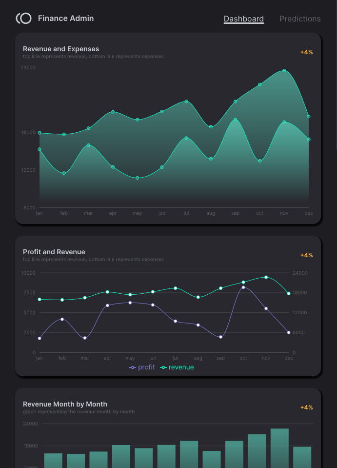

# Finance Admin

Welcome to the Finance Admin project repository! Finance Admin is a powerful dashboard designed to display comprehensive financial data for an ecommerce website. It provides insights into profits, revenue, product prices, expenses, operational and non-operational costs, as well as real-time information on recent orders.

## Table of Contents

- [Features](#features)
- [Demo](#demo)
- [Technologies](#technologies)

## Features

Finance Admin offers a range of features to help you manage and visualize your ecommerce website's financial data:

- **Financial Overview**: Get a quick snapshot of your profits, revenue, and expenses at a glance.
- **Product Pricing Analysis**: Monitor and analyze the prices of your products to optimize your pricing strategy.
- **Expense Tracking**: Keep track of both operational and non-operational expenses to manage your budget effectively.
- **Recent Orders**: View real-time information about the most recent orders, helping you stay on top of sales.
- **Data Visualization**: Interactive charts and graphs provide clear visual representations of your financial data.
- **User-Friendly Interface**: A user-friendly interface makes navigation and data interpretation intuitive.

## Demo

https://finance-dash-app.vercel.app/

## Technologies

Finance Admin is built using the following technologies:

  
  
  
  
  
  
  

### Frontend

- **React**: We chose React for its component-based architecture, making it easier to manage complex UI elements and data interactions within the dashboard.
- **Redux**: Redux provides a predictable state management system, allowing us to efficiently manage and update the application's global state, which is crucial for handling financial data.
- **TypeScript**: TypeScript enhances the development process by providing static type checking and improved code readability, reducing errors and making maintenance smoother.
- **Recharts**: Recharts offers a simple and customizable way to create data visualizations, enabling us to present financial data in a clear and engaging manner.
- **Material-UI (MUI)**: Material-UI's pre-designed components and responsive design allow us to create a polished and user-friendly interface for the dashboard.

### Backend

- **MongoDB**: MongoDB offers a flexible and scalable database solution, allowing us to store and manage the financial data efficiently.
- **Express**: Express is a fast and minimalist web application framework for Node.js, providing a solid foundation for building the backend of the application.

#### Disclaimer: The backend components are maintained in a distinct repository, following a microservice architecture approach. https://github.com/chanychi/fundwiz-server/

